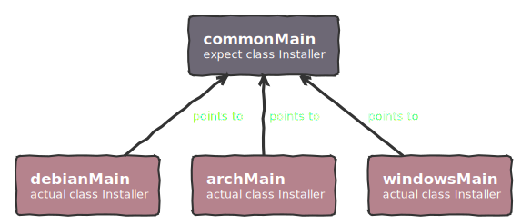
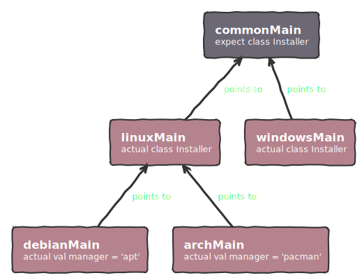

# Multiplatform Application Development

**Flutter and React Native** offer attractive solutions for multiplatform application development. The appeal lies in having a single codebase for the user interface, which reduces development time and costs. That is what [Compose Multiplatform](https://www.jetbrains.com/fr-fr/lp/compose-multiplatform/) aims to achieve: **Sharing 100% of the code**.  

However, imagine we're trying to build a CLI package manager that will work on all platforms: *Windows*, *Debian*, *Archlinux* etc., while keeping compatibility with original package managers.  
We would **NOT** want to have a single codebase. Having **platform-specific** code is necessary to wrap around existing package managers: `apt` on Debian-based distros, `pacman` on Archlinux-based distros and `winget` on Windows.

# Traditional Approach

## Conditional compilation

A traditional approach to developing platform-specific code involves the use of **conditional compilation**, using preprocessor directives. This method allows the compilation of code segments based on the target platform.

Consider the following C++ example:

```C++
#ifdef WINDOWS
std::cout << "This is Windows." << std::endl;
#elif defined(DEBIAN)
std::cout << "This is Debian Linux." << std::endl;
#elif defined(ARCHLINUX)
std::cout << "This is Arch Linux." << std::endl;
#else
std::cout << "Unknown platform." << std::endl;
#endif
```

## Runtime checks

In languages lacking a preprocessor for direct conditional compilation, it's required to implement platform detection **at runtime**. Here's a JavaScript example:

```ts
const textValue = Platform.select({
  ios: () => 'this is an iOS device',
  android: () => 'this is an Android device',
  default: () => 'this is not an iOS or Android device',
});
```

## Shared library

For applications requiring extensive cross-platform compatibility, a strategic approach involves the development around a **shared core library**. This shared component contains common functionality, whereas platform-specific adaptations are managed within **sub-applications**.  

However, the shared library itself remains devoid of platform-dependent code, ensuring its universal applicability across different environments. [Electron](https://github.com/electron/electron) uses a similar architecture.

Here's a sample directory structure for such projects:

```kotlin
.
|-- shared
|   |-- src
|       |-- main  // Code that will work everywhere
|-- debian-app
|   |-- src
|       |-- main  // Debian-specific code
|-- arch-app
|   |-- src
|       |-- main  // Archlinux-specific code
|-- windows-app
    |-- src
        |-- main  // Windows-specific code
```

# Kotlin Multiplatform Brilliant Idea

**Kotlin Multiplatform** (KMP) enables the creation of shared libraries that can contain code specific to each platform by using the `expect`/`actual` keywords. This allows any `expect` declaration to be matched with the corresponding `actual` implementation, depending on the target platform specified during compilation.



This brilliant architectural idea can save your team plenty of time by cutting down on **boilerplate** code, making it easier to maintain, and providing more **flexibility** and **control** over the platform-specific code.

Let's look at an example of a multiplatform `PackageManager` singleton for Debian and Archlinux:

```kotlin
// Common module @ commonMain/package/PackageManager.kt
expect class PackageManager {
    fun install(packageName: String): Boolean
    fun uninstall(packageName: String): Boolean
}

// Debian module @ debianMain/package/PackageManager.debian.kt
actual class PackageManager {
    actual fun install(packageName: String): Boolean {
        // Implementation using 'apt'
    }

    actual fun uninstall(packageName: String): Boolean {
        // Implementation using 'apt'
    }
}

// Archlinux module @ archMain/package/PackageManager.arch.kt
actual class PackageManager {
    actual fun install(packageName: String): Boolean {
        // Implementation using 'pacman'
    }

    actual fun uninstall(packageName: String): Boolean {
        // Implementation using 'pacman'
    }
}
```

This approach not only allows for leveraging platform-specific functionalities but also maintains a **clean and unified code structure**. Developers can easily extend support to additional platforms without altering the shared codebase.

Here's a suggested project structure for this KMP setup:

```kotlin
.
|-- build.gradle.kts
|-- settings.gradle.kts
|-- shared
|   |-- build.gradle.kts // Sub-project: KMP Library
|   |-- src
|       |-- commonMain   // Agnostic code & expected declarations 
|       |-- archMain     // Archlinux actual implementations
|       |-- debianMain   // Debian actual implementations
|       |-- windowsMain  // Windows actual implementations
|-- linux-app
|   |-- build.gradle.kts // Sub-project: Linux sub-application
|   |-- src
|       |-- main         // Use commonMain, debianMain & archMain
|-- windows-app
    |-- build.gradle.kts // Sub-project: Windows sub-application
    |-- src
        |-- main         // Use commonMain & windowsMain
```

It is even possible to make the Linux implementation more generic by creating a `linuxMain` source directory that contains all the implementations specific to various Linux distributions.



KMP elevates the concept of cross-platform development by introducing a **hierarchical structure** of source sets.  
Developers can effortlessly navigate through the codebase, identifying shared functionality and platform-specific implementations at a glance. 

# Real World Example
## Let's create a startup!

This powerful approach could be used - as example - for **payment terminals**. Let's create a new startup that provides and maintain KMP libraries, enabling developers to maintain **a single codebase for their applications**. This solution will support **multiple vendors**, including *Ingenico*, *Pax*, *Verifone*, among others, and accommodate **different models** of their terminals.  
This approach streamlines development, **saving teams time** and, consequently, **money** by **simplifying the integration process** with various terminal models. Who would say no to such simplification?

## True Multiplatform UIs

The primary challenge in cross-platform programming is **the restricted support for UIs**. While *React*, *Flutter* or *Multiplatform Compose* offers a solution for supporting different platforms, it does not allow for the creation of custom UIs backends. This becomes a problem when developing for niche devices, like [Tetra](https://ingenico.com/en/products-services/payment-terminals/tetra), a Linux device **that only supports Qt** for its UI. Current UI frameworks do not permit the customization or creation of new widgets tailored for specific rendering engines.

[Redwood](https://github.com/cashapp/redwood) by Cash App aims to solve this problem.
