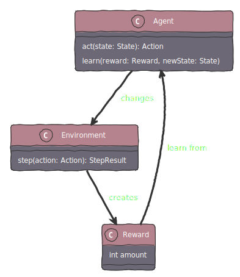
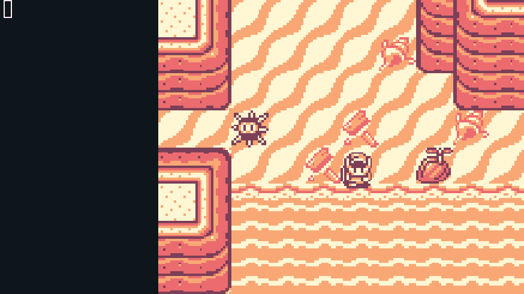

# Project

[**PyBoyEnv**](https://github.com/sofianedjerbi/PyBoyEnv) was a project I started at 18 to get hands-on with **reinforcement learning** and **gym environments**. It aimed to transform any **GameBoy** game into a playable environment, offering a unique way to explore AI learning and adaptation. This project was a big leap into the world of artificial intelligence for me, combining a personal challenge with my love for tech.



# Tech stack

## Python choice

**Python** is favored in data science for its simplicity and powerful libraries like **NumPy** and **pandas**, which simplify data tasks. Its readable syntax makes it ideal for both beginners and senior programmers, streamlining the process of data analysis and machine learning.

## Reinforcement learning

**Reinforcement learning** uses **gyms**, introduced by **OpenAI**, as environments where agents learn by trial and error. These gyms offer diverse scenarios for training algorithms, making them essential for testing and improving decision-making skills in a controlled environment.

```python
env = gym.make('CartPole-v1')       # Create a new Gym environment

for _ in range(100):
    env.render()                    # Show the environment
    action = agent.act(observation) # Agent act based on observation
    observation, \                  # Perform the action and 
    reward, \                       # observe the new state
    done, \                         # Get rewards and more info
    info = env.step(action)         
    if done:                        # Check if we finished
        print("Episode finished after {} timesteps".format(_+1))
        break

env.close()
```

# Memory events

## Concept

For **GameBoy games**, tracking specific **memory values** lets us detect key in-game **events** and tie them to **rewards** in reinforcement learning. By linking these values to player achievements or failures, it's possible to train AI agents more effectively, guiding their actions towards desired game outcomes through a tailored **reward system**.

## How to

Let's take "The Legend of Zelda: Link's Awakening DX" as example. [**Cheat codes**](https://en.wikibooks.org/wiki/The_Legend_of_Zelda:_Link%27s_Awakening/Cheats) provide a valuable resource for understanding how in-game events are triggered and managed through **memory values**. We can **decrypt and analyze** how these codes alter the game's memory using tools available on [gamehacking.org](https://gamehacking.org/system/gbc). This decryption process reveals specific **memory addresses** and the modifications they undergo, guiding us in identifying which memory values to monitor for rewards.

For example, to monitor *health changes*, we can use the *Infinite Health* cheatcode `01185ADB`. According to gamehacking.org, this cheat code writes `0x18` to memory address `0xDB5A`. Knowing this, we can establish the following rule:

```python
env.set_reward_rule(0xDB5A, 'increase', 1, "Health") # Gaining health = +1
env.set_reward_rule(0xDB5A, 'decrease', -1, "Health") # Losing health = -1
```

# Example

By applying the earlier technique and including extra rules to monitor more memory addresses, we end up with the following code:

```python
import gym
import pyboyenv

env = gym.make('PyBoy-v0', game='DX.gbc', visible=True)

env.set_reward_rule(0xDB5A, 'increase', 1, "Health")  # Label not required
env.set_reward_rule(0xDB5A, 'decrease', -1, "Health") # Health
env.set_reward_rule(0xDB5E, 'increase', 1, "Money")   # Money
env.set_reward_rule(0xDB45, 'increase', 1, "Arrows")  # Arrows
env.set_reward_rule(0xDB4D, 'increase', 1, "Bombs")   # Bombs
env.set_reward_rule(0xDBD0, 'increase', 1, "Keys")    # Keys
env.set_reward_rule(0xDBCF, 'increase', 5, "Big Keys")  # Big Keys
env.set_reward_rule(0xD368, 'equals 3', -25, "Death")   # Death
env.set_reward_rule(0xD360, 'equals 3', 1, "Hit Enemy") # Hit enemy
env.set_reward_rule(0xD360, 'equals 1', 2, "Loot")      # Loot
env.set_reward_rule(                                    # Events
    0xD368, 
    'in 59,15,16,21,49,24,25,27,30,33,34,39', 
    25, 
    "Event"
)  # Events
env.set_done_rule(0xD368, 'equals 3', "Death") # Done if player dies


env.reset()

cumul = 0
done = False
while not done:
    state, reward, done, info = env.step(16) # 16 = nothing..
    cumul += reward
    for i in info:
        print(f"{i[0]}: {i[1]}")
```

The code provided sets up the following environment:  




