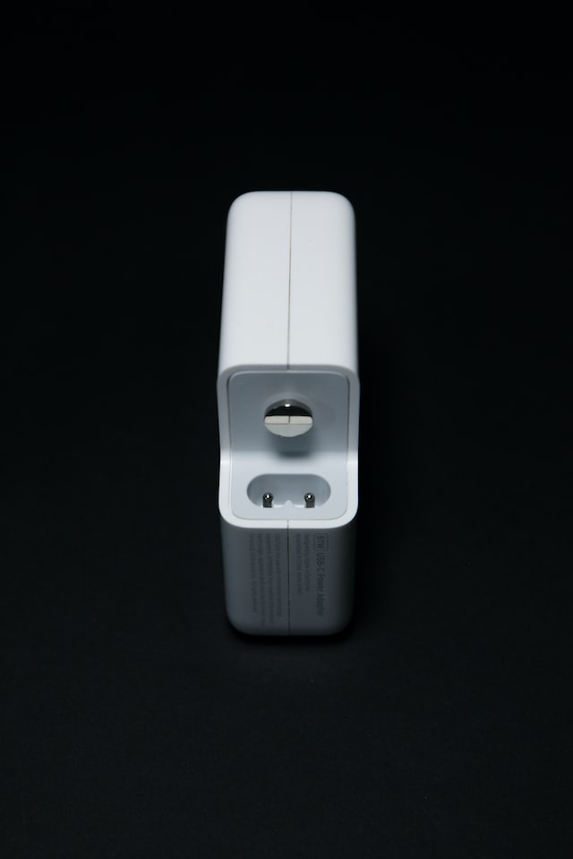
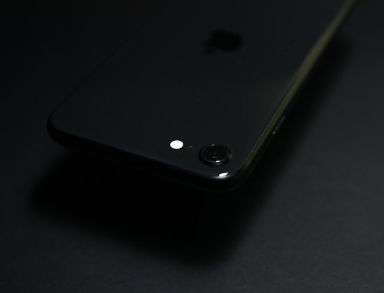
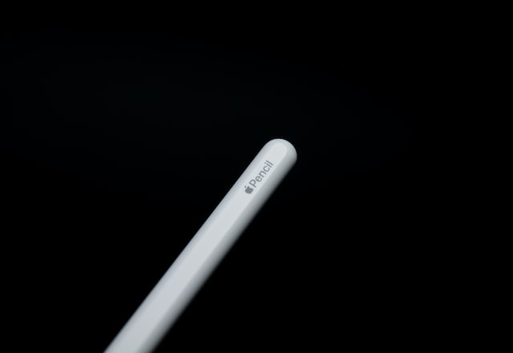

As a designer at Big corp, my role is to create visually stunning and user-friendly experiences for a wide range of Big corp products and services. I work closely with cross-functional teams, utilizing my design skills and knowledge of Big corp's design principles to drive innovation and develop new ideas. My job involves conceptualizing and prototyping ideas, iterating on designs, and presenting my work to stakeholders. To excel in this role, I stay up-to-date on the latest design trends and technologies, and apply them in a way that aligns with Big corp's brand and values. Overall, I take great pride in contributing to the legacy of elegant and intuitive design that is synonymous with Big corp.